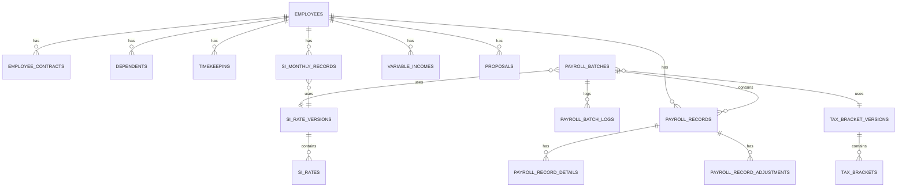
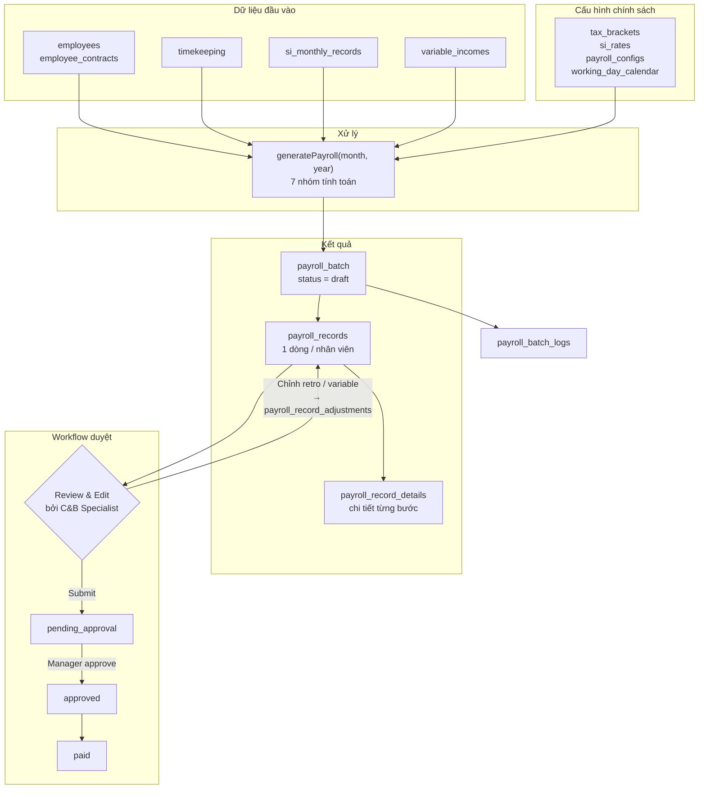

# Tài Liệu Thiết Kế Cơ Sở Dữ Liệu — iPayroll

## 1. Lựa Chọn Loại Cơ Sở Dữ Liệu

**Quyết định: PostgreSQL (Relational Database)**

Lý do chọn RDBMS thay vì NoSQL:

* Dữ liệu lương có cấu trúc rõ ràng, quan hệ chặt chẽ giữa nhân viên → chấm công → bảo hiểm → payroll record
* ACID transactions bắt buộc: chạy lương là batch operation, cần rollback nếu lỗi giữa chừng
* Tính toán tổng hợp (SUM, GROUP BY theo phòng ban, tháng, năm) rất hiệu quả trên SQL
* Audit trail và lịch sử thay đổi dễ implement
* Dữ liệu cấu hình (thuế, bảo hiểm) thay đổi theo năm → cần versioning theo `effective_date`

**Tại sao không chọn:**

* MongoDB/DynamoDB: Phù hợp document-oriented, không cần ACID mạnh — không phù hợp với bài toán lương có ràng buộc chặt
* Redis: Cache layer, không phải primary store
* MySQL: Thiếu kiểu JSONB (cần cho `payroll_record_details`), hỗ trợ window function yếu hơn PostgreSQL


---

## 2. Nguyên Tắc Thiết Kế

| Nguyên tắc | Mô tả |
|----|----|
| **Config-driven** | Mọi tỷ lệ (BHXH, BHYT, BHTN, khung thuế TNCN) đều lưu vào bảng cấu hình có `effective_date` — khi Nhà nước thay đổi chỉ cần thêm dòng mới, không sửa code |
| **Input/Output tách biệt** | Bảng input (`timekeeping`, `variable_income`, `employee`) lưu dữ liệu gốc. Bảng output (`payroll_record`) lưu kết quả tính toán đầy đủ, không tính lại khi đọc |
| **Immutable history** | Payroll batch đã `approved` → không sửa, chỉ tạo adjustment batch mới |
| **Snapshot tại thời điểm chạy** | `payroll_records` lưu lại toàn bộ dữ liệu đầu vào đã dùng (gói lương, ngày công, số người phụ thuộc...) để tránh phụ thuộc vào dữ liệu gốc có thể thay đổi sau |
| **Soft delete** | Dùng `deleted_at` thay vì xóa cứng trên các bảng master data |


---

## 3. Sơ Đồ Quan Hệ Tổng Quan (ERD)




---

## 4. Thiết Kế Chi Tiết Từng Nhóm Bảng

### 4.1 Nhóm Nhân Viên (Master Data)

#### `employees` — Thông tin nhân sự cốt lõi

```sql
CREATE TABLE employees (
    id                  UUID PRIMARY KEY DEFAULT gen_random_uuid(),
    employee_code       VARCHAR(20)  NOT NULL UNIQUE,   -- VD: EMP001
    full_name           VARCHAR(200) NOT NULL,
    email               VARCHAR(200) NOT NULL UNIQUE,
    phone               VARCHAR(20),
    bank_account        VARCHAR(50),
    bank_name           VARCHAR(100),
    department          VARCHAR(100),
    position            VARCHAR(100),
    level               VARCHAR(20) CHECK (level IN ('junior','mid','senior','manager','director')),
    org_level_1         VARCHAR(100),                   -- Công ty
    org_level_2         VARCHAR(100),                   -- Khối
    org_level_3         VARCHAR(100),                   -- Phòng ban
    org_level_4         VARCHAR(100),                   -- Bộ phận
    org_level_5         VARCHAR(100),                   -- Nhóm
    status              VARCHAR(30) NOT NULL CHECK (status IN (
                            'chinh_thuc','thai_san','nghi_viec_ct',
                            'het_thu_viec','thu_viec','nghi_viec_tv'
                        )),
    onboard_date        DATE,                           -- Ngày bắt đầu thử việc
    official_date       DATE,                           -- Ngày chính thức
    last_working_date   DATE,
    cost_account        VARCHAR(20),                    -- Mã tài khoản GL (6421...)
    created_at          TIMESTAMPTZ NOT NULL DEFAULT now(),
    updated_at          TIMESTAMPTZ NOT NULL DEFAULT now(),
    deleted_at          TIMESTAMPTZ
);
```

> **Lưu ý thiết kế:** `status` lưu trạng thái hiện tại của nhân viên. Lịch sử thay đổi trạng thái (nếu cần) có thể lưu vào bảng `employee_status_logs` trong tương lai.


---

#### `employee_contracts` — Gói lương theo loại hợp đồng (version hóa)

```sql
CREATE TABLE employee_contracts (
    id                  UUID PRIMARY KEY DEFAULT gen_random_uuid(),
    employee_id         UUID NOT NULL REFERENCES employees(id),
    contract_type       VARCHAR(10) NOT NULL CHECK (contract_type IN ('hdtv','hdld')),
                        -- hdtv = Hợp đồng thử việc (không có phone allowance)
                        -- hdld = Hợp đồng lao động (có phone allowance)
    base_salary         NUMERIC(15,0) NOT NULL,
    lunch_allowance     NUMERIC(15,0) NOT NULL DEFAULT 730000,
    phone_allowance     NUMERIC(15,0) NOT NULL DEFAULT 500000,
    effective_date      DATE NOT NULL,                  -- Ngày bắt đầu áp dụng gói lương
    end_date            DATE,                           -- NULL = đang hiệu lực
    created_at          TIMESTAMPTZ NOT NULL DEFAULT now()
);
```

> **Quy tắc lấy gói lương khi chạy lương tháng T:**
>
> ```sql
> SELECT * FROM employee_contracts
> WHERE employee_id = :emp_id
>   AND contract_type = :type
>   AND effective_date <= date_trunc('month', :payroll_date)
>   AND (end_date IS NULL OR end_date > date_trunc('month', :payroll_date))
> ORDER BY effective_date DESC
> LIMIT 1;
> ```
>
> Nếu lương thay đổi giữa tháng → chỉ áp dụng từ tháng sau.


---

#### `dependents` — Người phụ thuộc (giảm trừ gia cảnh TNCN)

```sql
CREATE TABLE dependents (
    id                  UUID PRIMARY KEY DEFAULT gen_random_uuid(),
    employee_id         UUID NOT NULL REFERENCES employees(id),
    full_name           VARCHAR(200) NOT NULL,
    relationship        VARCHAR(50),                    -- VD: con, vợ/chồng, cha/mẹ
    tax_id              VARCHAR(20),                    -- Mã số thuế người phụ thuộc
    registered_from     DATE NOT NULL,
    registered_to       DATE                            -- NULL = còn hiệu lực
);
```

> **Cách tính số người phụ thuộc hiệu lực trong tháng:**
>
> ```sql
> SELECT COUNT(*) FROM dependents
> WHERE employee_id = :emp_id
>   AND registered_from <= :last_day_of_month
>   AND (registered_to IS NULL OR registered_to >= :first_day_of_month);
> ```


---

### 4.2 Nhóm Cấu Hình Chính Sách (Policy Config)

> **Đây là phần quan trọng nhất** để đảm bảo dễ thay đổi khi Nhà nước cập nhật chính sách mà không cần sửa code.

#### `tax_bracket_versions` — Phiên bản bộ khung thuế TNCN

```sql
CREATE TABLE tax_bracket_versions (
    id              UUID PRIMARY KEY DEFAULT gen_random_uuid(),
    name            VARCHAR(100) NOT NULL,              -- VD: "Biểu thuế TNCN 2024"
    effective_from  DATE NOT NULL,
    effective_to    DATE,                               -- NULL = đang áp dụng
    created_by      UUID REFERENCES users(id),
    created_at      TIMESTAMPTZ NOT NULL DEFAULT now()
);
```

#### `tax_brackets` — Chi tiết từng bậc thuế lũy tiến

```sql
CREATE TABLE tax_brackets (
    id              UUID PRIMARY KEY DEFAULT gen_random_uuid(),
    version_id      UUID NOT NULL REFERENCES tax_bracket_versions(id),
    bracket_order   INT NOT NULL,                       -- Thứ tự bậc: 1..7
    income_from     NUMERIC(15,0) NOT NULL,
    income_to       NUMERIC(15,0),                      -- NULL = không giới hạn (bậc 7)
    rate            NUMERIC(5,4) NOT NULL,              -- 0.05, 0.10, 0.15, 0.20, 0.25, 0.30, 0.35
    UNIQUE(version_id, bracket_order)
);
```

**Dữ liệu mẫu (biểu thuế hiện hành theo Luật thuế TNCN):**

| bracket_order | income_from | income_to | rate |
|----|----|----|----|
| 1 | 0 | 5,000,000 | 5% |
| 2 | 5,000,000 | 10,000,000 | 10% |
| 3 | 10,000,000 | 18,000,000 | 15% |
| 4 | 18,000,000 | 32,000,000 | 20% |
| 5 | 32,000,000 | 52,000,000 | 25% |
| 6 | 52,000,000 | 80,000,000 | 30% |
| 7 | 80,000,000 | NULL | 35% |


---

#### `si_rate_versions` — Phiên bản tỷ lệ bảo hiểm xã hội

```sql
CREATE TABLE si_rate_versions (
    id              UUID PRIMARY KEY DEFAULT gen_random_uuid(),
    name            VARCHAR(100) NOT NULL,              -- VD: "Tỷ lệ BHXH 2024"
    effective_from  DATE NOT NULL,
    effective_to    DATE,
    created_at      TIMESTAMPTZ NOT NULL DEFAULT now()
);
```

#### `si_rates` — Chi tiết tỷ lệ BHXH / BHYT / BHTN

```sql
CREATE TABLE si_rates (
    id          UUID PRIMARY KEY DEFAULT gen_random_uuid(),
    version_id  UUID NOT NULL REFERENCES si_rate_versions(id),
    si_type     VARCHAR(20) NOT NULL CHECK (si_type IN ('bhxh','bhyt','bhtn','union_fee')),
    party       VARCHAR(20) NOT NULL CHECK (party IN ('employee','employer')),
    rate        NUMERIC(5,4) NOT NULL,
    UNIQUE(version_id, si_type, party)
);
```

**Dữ liệu mẫu (tỷ lệ hiện hành):**

| si_type | party | rate |
|----|----|----|
| bhxh | employee | 0.0800 |
| bhyt | employee | 0.0150 |
| bhtn | employee | 0.0100 |
| bhxh | employer | 0.1750 |
| bhyt | employer | 0.0300 |
| bhtn | employer | 0.0100 |
| union_fee | employer | 0.0200 |


---

#### `payroll_configs` — Các hằng số chính sách (effective date-driven)

```sql
CREATE TABLE payroll_configs (
    id              UUID PRIMARY KEY DEFAULT gen_random_uuid(),
    config_key      VARCHAR(100) NOT NULL,
    config_value    NUMERIC(20,4) NOT NULL,
    effective_from  DATE NOT NULL,
    effective_to    DATE,
    description     TEXT
);

CREATE UNIQUE INDEX idx_payroll_configs_active
    ON payroll_configs(config_key, effective_from);
```

**Danh sách** `config_key` và giá trị hiện tại:

| config_key | Giá trị | Mô tả |
|----|----|----|
| `personal_deduction` | 15,500,000 | Giảm trừ bản thân (VNĐ/tháng) |
| `dependent_deduction` | 6,200,000 | Giảm trừ mỗi người phụ thuộc (VNĐ/tháng) |
| `si_min_base` | 5,310,000 | Mức sàn tính đóng BHXH |
| `si_base_ratio` | 0.5000 | Tỷ lệ tính mức đóng BHXH (50% lương cơ bản) |
| `lunch_nontaxable_limit` | 730,000 | Mức cơm trưa miễn thuế TNCN (VNĐ/tháng) |
| `phone_nontaxable_limit` | 500,000 | Mức điện thoại miễn thuế TNCN (VNĐ/tháng) |
| `flat_pit_rate` | 0.1000 | Thuế TNCN 10% cho HĐTV / hợp đồng ngắn hạn |
| `standard_days_default` | 20 | Ngày công chuẩn mặc định |


---

#### `working_day_calendar` — Ngày công chuẩn theo tháng

```sql
CREATE TABLE working_day_calendar (
    id              UUID PRIMARY KEY DEFAULT gen_random_uuid(),
    year            INT NOT NULL,
    month           INT NOT NULL CHECK (month BETWEEN 1 AND 12),
    standard_days   INT NOT NULL,                       -- Thường 20, một số tháng 22
    note            VARCHAR(200),
    UNIQUE(year, month)
);
```

> Tháng 10 và tháng 12 thường có 22 ngày công chuẩn trong hệ thống hiện tại.


---

### 4.3 Nhóm Dữ Liệu Đầu Vào Hàng Tháng (Input)

#### `timekeeping` — Chấm công hàng tháng

```sql
CREATE TABLE timekeeping (
    id                        UUID PRIMARY KEY DEFAULT gen_random_uuid(),
    employee_id               UUID NOT NULL REFERENCES employees(id),
    year                      INT NOT NULL,
    month                     INT NOT NULL CHECK (month BETWEEN 1 AND 12),
    standard_days             INT NOT NULL,
    actual_days               NUMERIC(5,2) NOT NULL DEFAULT 0,
    probation_days            NUMERIC(5,2) NOT NULL DEFAULT 0,
    official_days             NUMERIC(5,2) NOT NULL DEFAULT 0,
    remaining_leave           NUMERIC(5,2) NOT NULL DEFAULT 0,
    unpaid_leave              NUMERIC(5,2) NOT NULL DEFAULT 0,
    unpaid_leave_probation    NUMERIC(5,2) NOT NULL DEFAULT 0,
    unpaid_leave_official     NUMERIC(5,2) NOT NULL DEFAULT 0,
    created_at                TIMESTAMPTZ NOT NULL DEFAULT now(),
    updated_at                TIMESTAMPTZ NOT NULL DEFAULT now(),
    UNIQUE(employee_id, year, month)
);
```

> **Ràng buộc nghiệp vụ cần kiểm tra ở tầng ứng dụng:**
>
> * `probation_days + official_days = actual_days`
> * `actual_days <= standard_days`
> * Nếu nhân viên không có `official_date` trong tháng → `probation_days = actual_days`, `official_days = 0`


---

#### `si_monthly_records` — Bảo hiểm xã hội hàng tháng

```sql
CREATE TABLE si_monthly_records (
    id                  UUID PRIMARY KEY DEFAULT gen_random_uuid(),
    employee_id         UUID NOT NULL REFERENCES employees(id),
    year                INT NOT NULL,
    month               INT NOT NULL CHECK (month BETWEEN 1 AND 12),
    si_base             NUMERIC(15,0) NOT NULL DEFAULT 0,
                        -- = MAX(base_salary * si_base_ratio, si_min_base)
    is_exempt           BOOLEAN NOT NULL DEFAULT FALSE,
    exempt_reason       VARCHAR(200),
                        -- VD: "Thai sản", "Thử việc", "Nghỉ việc trước 15"
    bhxh_employee       NUMERIC(15,0) NOT NULL DEFAULT 0,
    bhyt_employee       NUMERIC(15,0) NOT NULL DEFAULT 0,
    bhtn_employee       NUMERIC(15,0) NOT NULL DEFAULT 0,
    si_employee_total   NUMERIC(15,0) NOT NULL DEFAULT 0,
    bhxh_employer       NUMERIC(15,0) NOT NULL DEFAULT 0,
    bhyt_employer       NUMERIC(15,0) NOT NULL DEFAULT 0,
    bhtn_employer       NUMERIC(15,0) NOT NULL DEFAULT 0,
    si_employer_total   NUMERIC(15,0) NOT NULL DEFAULT 0,
    union_fee           NUMERIC(15,0) NOT NULL DEFAULT 0,
    si_rate_version_id  UUID REFERENCES si_rate_versions(id),
    UNIQUE(employee_id, year, month)
);
```

**Quy tắc miễn đóng BHXH theo trạng thái nhân viên:**

| Trạng thái | BHXH | BHYT | BHTN | Ghi chú |
|----|----|----|----|----|
| `chinh_thuc` | ✓ | ✓ | ✓ | Đóng đủ |
| `thai_san` | ✗ | ✗ | ✗ | Miễn toàn bộ |
| `het_thu_viec` + hoàn thành trước 15 | ✓ | ✓ | ✓ | Đóng từ tháng hiện tại |
| `het_thu_viec` + hoàn thành sau 15 | ✗ | ✗ | ✗ | Đóng từ tháng sau |
| `thu_viec` | ✗ | ✗ | ✗ | Chưa đăng ký BHXH |
| `nghi_viec_ct` + `unpaid_leave > 14` | ✗ | ✓ | ✗ | Chỉ đóng BHYT |
| `nghi_viec_ct` + `unpaid_leave ≤ 14` | ✓ | ✓ | ✓ | Đóng đủ |
| `nghi_viec_tv` | ✗ | ✗ | ✗ | Chưa đăng ký BHXH |


---

#### `variable_incomes` — Thu nhập biến động hàng tháng (nhập tay)

```sql
CREATE TABLE variable_incomes (
    id                      UUID PRIMARY KEY DEFAULT gen_random_uuid(),
    employee_id             UUID NOT NULL REFERENCES employees(id),
    year                    INT NOT NULL,
    month                   INT NOT NULL CHECK (month BETWEEN 1 AND 12),
    commission              NUMERIC(15,0) NOT NULL DEFAULT 0,
    commission_detail       TEXT,
    bonus                   NUMERIC(15,0) NOT NULL DEFAULT 0,
    bonus_detail            TEXT,
    other_income            NUMERIC(15,0) NOT NULL DEFAULT 0,
    other_income_detail     TEXT,
    other_allowance         NUMERIC(15,0) NOT NULL DEFAULT 0,
    other_allowance_detail  TEXT,
    updated_by              UUID REFERENCES users(id),
    updated_at              TIMESTAMPTZ NOT NULL DEFAULT now(),
    UNIQUE(employee_id, year, month)
);
```


---

### 4.4 Nhóm Kết Quả Tính Lương (Output)

#### `payroll_batches` — Đợt chạy lương

```sql
CREATE TABLE payroll_batches (
    id                      UUID PRIMARY KEY DEFAULT gen_random_uuid(),
    year                    INT NOT NULL,
    month                   INT NOT NULL CHECK (month BETWEEN 1 AND 12),
    status                  VARCHAR(20) NOT NULL DEFAULT 'draft'
                                CHECK (status IN ('draft','pending_approval','approved','paid')),
    tax_bracket_version_id  UUID REFERENCES tax_bracket_versions(id),
    si_rate_version_id      UUID REFERENCES si_rate_versions(id),
    -- Tổng hợp (denormalized để hiển thị nhanh)
    total_employees         INT NOT NULL DEFAULT 0,
    total_gross             NUMERIC(18,0) NOT NULL DEFAULT 0,
    total_net               NUMERIC(18,0) NOT NULL DEFAULT 0,
    total_pit               NUMERIC(18,0) NOT NULL DEFAULT 0,
    total_si_employee       NUMERIC(18,0) NOT NULL DEFAULT 0,
    total_employer_cost     NUMERIC(18,0) NOT NULL DEFAULT 0,
    -- Workflow
    created_by              UUID NOT NULL REFERENCES users(id),
    created_at              TIMESTAMPTZ NOT NULL DEFAULT now(),
    submitted_at            TIMESTAMPTZ,
    approved_by             UUID REFERENCES users(id),
    approved_at             TIMESTAMPTZ,
    paid_at                 TIMESTAMPTZ,
    UNIQUE(year, month)
);
```


---

#### `payroll_records` — Bản ghi lương từng nhân viên (7 nhóm tính toán)

Bảng này lưu **toàn bộ kết quả tính toán** theo 7 nhóm, đồng thời snapshot lại dữ liệu đầu vào đã dùng để đảm bảo tính bất biến lịch sử.

```sql
CREATE TABLE payroll_records (
    id                          UUID PRIMARY KEY DEFAULT gen_random_uuid(),
    batch_id                    UUID NOT NULL REFERENCES payroll_batches(id),
    employee_id                 UUID NOT NULL REFERENCES employees(id),

    -- === SNAPSHOT: Gói lương hợp đồng tại thời điểm chạy ===
    -- HĐLĐ (Hợp đồng lao động)
    pkg_base_salary             NUMERIC(15,0) NOT NULL DEFAULT 0,
    pkg_lunch                   NUMERIC(15,0) NOT NULL DEFAULT 0,
    pkg_phone                   NUMERIC(15,0) NOT NULL DEFAULT 0,
    pkg_perf_bonus              NUMERIC(15,0) NOT NULL DEFAULT 0,  -- = base - lunch - phone
    pkg_total                   NUMERIC(15,0) NOT NULL DEFAULT 0,
    -- HĐTV (Hợp đồng thử việc)
    prob_pkg_base_salary        NUMERIC(15,0) NOT NULL DEFAULT 0,
    prob_pkg_lunch              NUMERIC(15,0) NOT NULL DEFAULT 0,
    prob_pkg_perf_bonus         NUMERIC(15,0) NOT NULL DEFAULT 0,  -- = base - lunch
    prob_pkg_total              NUMERIC(15,0) NOT NULL DEFAULT 0,

    -- === NHÓM 1: Lương thực tế đã prorate theo ngày công ===
    standard_days               INT NOT NULL,
    actual_days                 NUMERIC(5,2) NOT NULL DEFAULT 0,
    probation_days              NUMERIC(5,2) NOT NULL DEFAULT 0,
    official_days               NUMERIC(5,2) NOT NULL DEFAULT 0,
    unpaid_leave_probation      NUMERIC(5,2) NOT NULL DEFAULT 0,
    unpaid_leave_official       NUMERIC(5,2) NOT NULL DEFAULT 0,
    remaining_leave             NUMERIC(5,2) NOT NULL DEFAULT 0,
    prorated_base_salary        NUMERIC(15,0) NOT NULL DEFAULT 0,
    prorated_perf_bonus         NUMERIC(15,0) NOT NULL DEFAULT 0,
    total_lunch_actual          NUMERIC(15,0) NOT NULL DEFAULT 0,
    total_phone_actual          NUMERIC(15,0) NOT NULL DEFAULT 0,  -- Không prorate, trả đủ
    prorated_total              NUMERIC(15,0) NOT NULL DEFAULT 0,

    -- === NHÓM 2: Thu nhập biến động & Gross ===
    commission                  NUMERIC(15,0) NOT NULL DEFAULT 0,
    bonus                       NUMERIC(15,0) NOT NULL DEFAULT 0,
    other_income                NUMERIC(15,0) NOT NULL DEFAULT 0,
    other_allowance             NUMERIC(15,0) NOT NULL DEFAULT 0,
    total_variable_income       NUMERIC(15,0) NOT NULL DEFAULT 0,
    gross_salary                NUMERIC(15,0) NOT NULL DEFAULT 0,
    -- Gross = prorated_total + total_variable_income

    -- === NHÓM 3: Thu nhập chịu thuế TNCN ===
    non_taxable_lunch           NUMERIC(15,0) NOT NULL DEFAULT 0,
    non_taxable_phone           NUMERIC(15,0) NOT NULL DEFAULT 0,
    taxable_income              NUMERIC(15,0) NOT NULL DEFAULT 0,
    -- Taxable = gross - non_taxable_lunch - non_taxable_phone

    -- === NHÓM 4: Bảo hiểm xã hội & Giảm trừ ===
    si_base                     NUMERIC(15,0) NOT NULL DEFAULT 0,
    si_bhxh                     NUMERIC(15,0) NOT NULL DEFAULT 0,
    si_bhyt                     NUMERIC(15,0) NOT NULL DEFAULT 0,
    si_bhtn                     NUMERIC(15,0) NOT NULL DEFAULT 0,
    si_employee_total           NUMERIC(15,0) NOT NULL DEFAULT 0,
    personal_deduction          NUMERIC(15,0) NOT NULL DEFAULT 0,
    dependent_count             INT NOT NULL DEFAULT 0,
    dependent_deduction         NUMERIC(15,0) NOT NULL DEFAULT 0,

    -- === NHÓM 5: Thuế TNCN ===
    tax_method                  VARCHAR(20) NOT NULL CHECK (tax_method IN ('progressive','flat_10')),
    tax_assessable_income       NUMERIC(15,0) NOT NULL DEFAULT 0,
    pit                         NUMERIC(15,0) NOT NULL DEFAULT 0,

    -- === NHÓM 6: Thực lĩnh ===
    union_fee                   NUMERIC(15,0) NOT NULL DEFAULT 0,  -- Hiển thị, không trừ vào lương
    retro_deduction             NUMERIC(15,0) NOT NULL DEFAULT 0,
    retro_addition              NUMERIC(15,0) NOT NULL DEFAULT 0,
    total_deduction             NUMERIC(15,0) NOT NULL DEFAULT 0,  -- PIT + SI (không gồm union_fee)
    net_salary                  NUMERIC(15,0) NOT NULL DEFAULT 0,
    -- Net = gross - total_deduction + retro_addition

    -- === NHÓM 7: Chi phí sử dụng lao động (Employer cost) ===
    si_employer_bhxh            NUMERIC(15,0) NOT NULL DEFAULT 0,
    si_employer_bhyt            NUMERIC(15,0) NOT NULL DEFAULT 0,
    si_employer_bhtn            NUMERIC(15,0) NOT NULL DEFAULT 0,
    si_employer_total           NUMERIC(15,0) NOT NULL DEFAULT 0,
    employer_union_fee          NUMERIC(15,0) NOT NULL DEFAULT 0,
    total_employer_cost         NUMERIC(15,0) NOT NULL DEFAULT 0,
    -- TotalEmployerCost = net + si_employer + employer_union_fee

    -- === Meta ===
    cost_account                VARCHAR(20),
    bank_account                VARCHAR(50),
    bank_name                   VARCHAR(100),
    is_manually_adjusted        BOOLEAN NOT NULL DEFAULT FALSE,
    notes                       TEXT,

    UNIQUE(batch_id, employee_id)
);
```


---

#### `payroll_record_details` — Chi tiết từng bước tính (audit trail / debug)

Bảng này cho phép truy vết ngược lại từng phép tính đã thực hiện.

```sql
CREATE TABLE payroll_record_details (
    id              UUID PRIMARY KEY DEFAULT gen_random_uuid(),
    record_id       UUID NOT NULL REFERENCES payroll_records(id) ON DELETE CASCADE,
    step_group      INT NOT NULL,               -- 1..7 tương ứng 7 nhóm
    step_name       VARCHAR(100) NOT NULL,      -- VD: "prorate_base_official"
    formula         TEXT,                       -- VD: "round(5000000 / 22 * 15)"
    input_values    JSONB,                      -- {"base": 5000000, "std": 22, "days": 15}
    result_value    NUMERIC(18,4) NOT NULL
);
```

**Ví dụ dữ liệu:**

| step_group | step_name | formula | input_values | result_value |
|----|----|----|----|----|
| 1 | prorate_base_official | round(5000000/22\*15) | `{"base":5000000,"std":22,"days":15}` | 3409091 |
| 4 | si_base_calc | max(5000000\*0.5, 5310000) | `{"base":5000000,"ratio":0.5,"min":5310000}` | 5310000 |
| 5 | pit_progressive | - | `{"assessable":8000000}` | 475000 |


---

### 4.5 Nhóm Audit & Workflow

#### `payroll_batch_logs` — Lịch sử thay đổi trạng thái batch

```sql
CREATE TABLE payroll_batch_logs (
    id              UUID PRIMARY KEY DEFAULT gen_random_uuid(),
    batch_id        UUID NOT NULL REFERENCES payroll_batches(id),
    action          VARCHAR(30) NOT NULL CHECK (action IN (
                        'created','submitted','approved','paid','rejected','record_updated'
                    )),
    from_status     VARCHAR(20),
    to_status       VARCHAR(20),
    changed_by      UUID NOT NULL REFERENCES users(id),
    changed_at      TIMESTAMPTZ NOT NULL DEFAULT now(),
    note            TEXT
);
```


---

#### `payroll_record_adjustments` — Lịch sử chỉnh sửa inline từng record

```sql
CREATE TABLE payroll_record_adjustments (
    id              UUID PRIMARY KEY DEFAULT gen_random_uuid(),
    record_id       UUID NOT NULL REFERENCES payroll_records(id),
    field_name      VARCHAR(100) NOT NULL,      -- VD: "retro_deduction", "commission"
    old_value       TEXT,
    new_value       TEXT,
    changed_by      UUID NOT NULL REFERENCES users(id),
    changed_at      TIMESTAMPTZ NOT NULL DEFAULT now(),
    reason          TEXT
);
```


---

#### `proposals` — Phiếu đề xuất / khiếu nại của nhân viên

```sql
CREATE TABLE proposals (
    id              UUID PRIMARY KEY DEFAULT gen_random_uuid(),
    employee_id     UUID NOT NULL REFERENCES employees(id),
    type            VARCHAR(20) NOT NULL CHECK (type IN ('timekeeping','payroll')),
    year            INT NOT NULL,
    month           INT NOT NULL,
    subject         VARCHAR(300) NOT NULL,
    description     TEXT,
    status          VARCHAR(20) NOT NULL DEFAULT 'pending'
                        CHECK (status IN ('pending','processing','resolved','rejected')),
    created_at      TIMESTAMPTZ NOT NULL DEFAULT now(),
    response        TEXT,
    responded_by    UUID REFERENCES users(id),
    responded_at    TIMESTAMPTZ
);
```


---

### 4.6 Nhóm Người Dùng & Quyền Hạn

#### `users` — Tài khoản hệ thống

```sql
CREATE TABLE users (
    id              UUID PRIMARY KEY DEFAULT gen_random_uuid(),
    name            VARCHAR(200) NOT NULL,
    email           VARCHAR(200) NOT NULL UNIQUE,
    role            VARCHAR(20) NOT NULL CHECK (role IN ('cb_specialist','manager','admin')),
    employee_id     UUID REFERENCES employees(id),      -- Liên kết nếu user là nhân viên
    avatar_url      TEXT,
    created_at      TIMESTAMPTZ NOT NULL DEFAULT now()
);
```

**Phân quyền theo role:**

| Hành động | cb_specialist | manager | admin |
|----|----|----|----|
| Xem bảng lương | ✓ | ✓ | ✓ |
| Tạo / chỉnh sửa bảng lương (draft) | ✓ | ✗ | ✓ |
| Submit để duyệt | ✓ | ✗ | ✓ |
| Phê duyệt bảng lương | ✗ | ✓ | ✓ |
| Xử lý proposals | ✓ | ✓ | ✓ |
| Quản lý cấu hình chính sách | ✗ | ✗ | ✓ |


---

## 5. Indexes

```sql
-- === Nhóm nhân viên ===
CREATE INDEX idx_employees_status ON employees(status) WHERE deleted_at IS NULL;
CREATE INDEX idx_employee_contracts_lookup
    ON employee_contracts(employee_id, contract_type, effective_date DESC);

-- === Nhóm cấu hình ===
CREATE INDEX idx_payroll_configs_key_date
    ON payroll_configs(config_key, effective_from DESC);
CREATE INDEX idx_tax_brackets_version
    ON tax_brackets(version_id, bracket_order);
CREATE INDEX idx_si_rates_version
    ON si_rates(version_id, si_type, party);

-- === Nhóm đầu vào hàng tháng ===
CREATE INDEX idx_timekeeping_period
    ON timekeeping(year, month, employee_id);
CREATE INDEX idx_si_monthly_period
    ON si_monthly_records(year, month, employee_id);
CREATE INDEX idx_variable_incomes_period
    ON variable_incomes(year, month, employee_id);

-- === Nhóm kết quả lương ===
CREATE INDEX idx_payroll_batches_period
    ON payroll_batches(year, month);
CREATE INDEX idx_payroll_batches_status
    ON payroll_batches(status);
CREATE INDEX idx_payroll_records_batch
    ON payroll_records(batch_id);
CREATE INDEX idx_payroll_records_employee
    ON payroll_records(employee_id);
CREATE INDEX idx_payroll_record_details_record
    ON payroll_record_details(record_id);

-- === Nhóm audit ===
CREATE INDEX idx_batch_logs_batch
    ON payroll_batch_logs(batch_id, changed_at DESC);
CREATE INDEX idx_proposals_employee
    ON proposals(employee_id, year, month);
```


---

## 6. Chiến Lược Xử Lý Thay Đổi Chính Sách

### Trường hợp: Nhà nước điều chỉnh khung thuế TNCN (ví dụ năm 2026)

```sql
-- Bước 1: Đóng version cũ
UPDATE tax_bracket_versions
SET effective_to = '2025-12-31'
WHERE effective_to IS NULL;

-- Bước 2: Tạo version mới
INSERT INTO tax_bracket_versions (name, effective_from)
VALUES ('Biểu thuế TNCN 2026', '2026-01-01');

-- Bước 3: Nhập bậc thuế mới
INSERT INTO tax_brackets (version_id, bracket_order, income_from, income_to, rate)
VALUES
    (:new_version_id, 1, 0, 5000000, 0.05),
    -- ... thêm các bậc còn lại
    (:new_version_id, 7, 80000000, NULL, 0.35);
```

### Trường hợp: Tăng mức giảm trừ bản thân

```sql
INSERT INTO payroll_configs (config_key, config_value, effective_from, description)
VALUES ('personal_deduction', 17000000, '2026-01-01', 'Tăng theo Nghị quyết ...');
```

### Truy vấn lấy cấu hình hiệu lực tại một tháng cụ thể

```sql
-- Lấy mức giảm trừ bản thân áp dụng cho tháng 3/2026
SELECT config_value FROM payroll_configs
WHERE config_key = 'personal_deduction'
  AND effective_from <= '2026-03-01'
  AND (effective_to IS NULL OR effective_to > '2026-03-01')
ORDER BY effective_from DESC
LIMIT 1;
```

> **Mọi batch đã** `approved` vẫn giữ nguyên `tax_bracket_version_id` và `si_rate_version_id` cũ. Toàn bộ giá trị đã tính được snapshot trong `payroll_records` → lịch sử không bị ảnh hưởng bởi thay đổi chính sách.


---

## 7. Luồng Dữ Liệu Khi Chạy Lương




---

## 8. Tóm Tắt Danh Sách Bảng

| Nhóm | Bảng | Mục đích |
|----|----|----|
| **Master data** | `employees` | Hồ sơ nhân viên |
|    | `employee_contracts` | Gói lương theo hợp đồng, có version |
|    | `dependents` | Người phụ thuộc giảm trừ TNCN |
|    | `users` | Tài khoản hệ thống & phân quyền |
| **Cấu hình chính sách** | `tax_bracket_versions` | Phiên bản khung thuế TNCN |
|    | `tax_brackets` | Chi tiết 7 bậc thuế lũy tiến |
|    | `si_rate_versions` | Phiên bản tỷ lệ BHXH/BHYT/BHTN |
|    | `si_rates` | Chi tiết tỷ lệ từng loại bảo hiểm |
|    | `payroll_configs` | Hằng số chính sách (giảm trừ, sàn BHXH...) |
|    | `working_day_calendar` | Ngày công chuẩn theo tháng/năm |
| **Đầu vào hàng tháng** | `timekeeping` | Dữ liệu chấm công |
|    | `si_monthly_records` | Số liệu BHXH đã tính |
|    | `variable_incomes` | Thu nhập biến động nhập tay |
| **Kết quả tính lương** | `payroll_batches` | Đợt chạy lương (1 batch/tháng) |
|    | `payroll_records` | Bản ghi lương từng nhân viên (7 nhóm) |
|    | `payroll_record_details` | Chi tiết từng bước tính (audit/debug) |
| **Audit & Workflow** | `payroll_batch_logs` | Lịch sử thay đổi trạng thái batch |
|    | `payroll_record_adjustments` | Lịch sử chỉnh sửa inline record |
|    | `proposals` | Phiếu đề xuất / khiếu nại nhân viên |

**Tổng: 19 bảng**